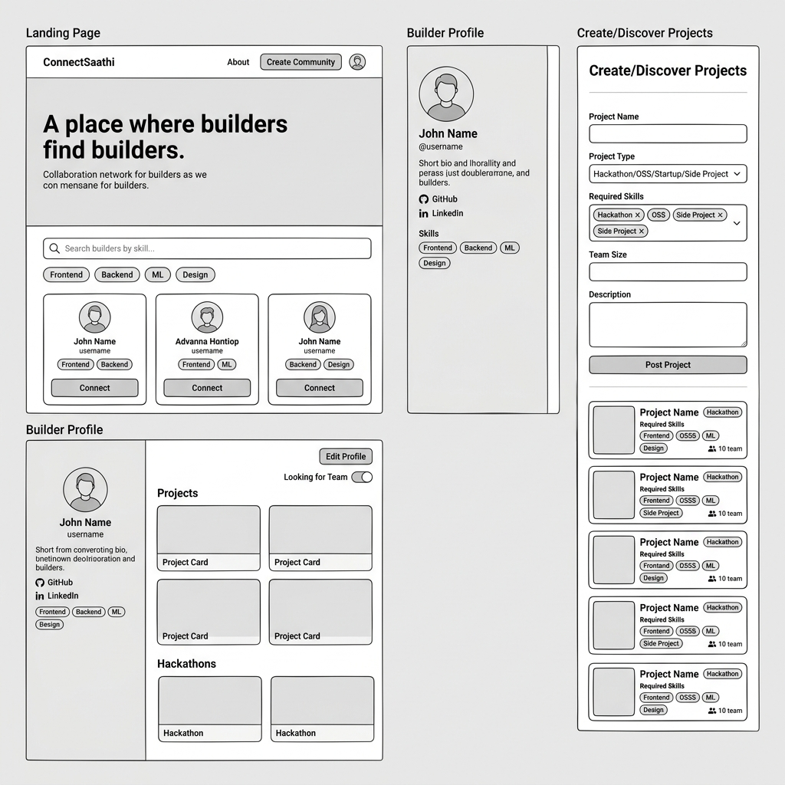

# This Contains the Wireframe, other details are present inside the Frontend-Folder:-
# ConnectSaathi — V0 Wireframes & Screen Documentation

> This document covers all screens **currently built and delivered** in V0.
> Features not yet implemented are clearly marked as **Next Phase**.

---

## 🗺️ Screens Built in V0



| # | Screen | Route | Status |
|---|---|---|---|
| 1 | Landing / Home Page | `/` | ✅ Built |
| 2 | Builder Profile Page | `/profile` | ✅ Built |
| 3 | Create Builder Profile | `/create-profile` | ✅ Built |
| 4 | Create Community | `/create-community` | ✅ Built |
| 5 | Community Info | `/communityinfo` | ✅ Built |
| 6 | Public Builder Profile | `/public-profile` | ✅ Built |

---

## Screen 1 — Landing / Home Page (`/`)

**Purpose:** The discovery hub. First thing users see. Showcases the platform and lets builders explore communities and search for collaborators.

### Layout & Components

| Zone | Component | What it does |
|---|---|---|
| Top | **Sticky Header / Navbar** | Logo left; "Create Community" CTA; hamburger for mobile; About/Contact links; notifications bell; profile avatar |
| Mobile | **Sidebar Drawer** | Slides in on hamburger click; shows all nav links + profile |
| Section 1 | **Hero Banner** | Full-width image with dark gradient overlay; headline "Build Teams. Connect Skills. Create Together."; platform tagline |
| Section 2 | **Search Section** | Skill search bar + filter chips (Frontend, Backend, ML, Design, etc.) to find builders |
| Section 3 | **Communities Section** | Cards of active communities on the platform |
| Section 4 | **Happy Users Section** | Social proof — showcases active collaborators with DiceBear avatars |
| Section 5 | **About Section** | Platform overview, value prop, mission |
| Bottom | **Footer** | Copyright + links |

### Key Interactions
- Filter chips narrow the search/discovery view
- Smooth scroll to About section from nav
- Mobile sidebar slides in/out with animation
- Profile avatar links to `/profile`

---

## Screen 2 — Builder Profile Page (`/profile`)

**Purpose:** A builder's full identity page — shows who they are, what they know, and what they've built. Editable by the owner.

### Layout & Components

| Zone | Component | What it does |
|---|---|---|
| Top bar | **Page Header** | "My Profile" title; dark mode toggle 🌙/☀️; Edit / Save Profile button |
| Left col | **Profile Header** | Avatar, name, username, bio, location, role, GitHub/LinkedIn/Portfolio/Website links |
| Left col | **Skills Section** | Tech stack as pill badges; in edit mode shows full searchable tag list |
| Left col | **Go to My Community** | Button that opens a modal showing the builder's communities |
| Right col | **Team Preferences** | "Looking for Team?" toggle switch |
| Right col | **Hackathon Section** | List of past hackathons with achievements; editable in edit mode (add/remove entries) |

### Key Interactions
- "Edit Profile" button switches all fields to inputs
- "Save Profile" persists the changes and exits edit mode
- Skills are selectable from 100+ tech stack options
- Dark mode toggle applies globally with smooth transition (Framer Motion)
- Community modal opens inline without page navigation

---

## Screen 3 — Create Builder Profile (`/create-profile`)

**Purpose:** Onboarding form for new builders to set up their identity on ConnectSaathi.

### Form Fields

| Field | Type | Required |
|---|---|---|
| Bio | Textarea | No |
| LinkedIn URL | URL input | ✅ Yes |
| GitHub URL | URL input | ✅ Yes |
| Portfolio URL | URL input | No |
| Years of Experience | Number | ✅ Yes |
| Skills / Tech Stack | Multi-select dropdown with search | No |
| Projects (name + link) | Dynamic list — add/remove | No |

### Key Interactions
- Skills picker opens a searchable dropdown overlay; selected skills appear as removable pill badges
- Projects list is dynamic — "Add Project" appends a new entry; "Remove" deletes it (disabled when only 1 remains)
- On submit: posts to backend API → redirects to `/home`
- Error state: displays inline error message if API fails

---

## Screen 4 — Create Community (`/create-community`)

**Purpose:** Builders form a project team or community, specifying what skills they need.

### Form Fields

| Field | Type | Required |
|---|---|---|
| Community / Project Name | Text input | ✅ Yes |
| Tech Skills Needed | Multi-select with search | ✅ Yes |
| Address / Location | Text input | ✅ Yes |
| Profile Icon | Grid of 12 avatar options | ✅ Yes |
| Experience | Textarea | ✅ Yes |
| Team Leader username | Text + Verify button | ✅ Yes |
| Additional Members | Dynamic list + Verify buttons | No |

### Key Interactions
- Skills dropdown is searchable and multi-select; "Confirm" closes it
- Avatar grid — click to select; selected item gets highlighted border
- "Verify" button calls API to check if username exists → shows ✅ Verified or ❌ Not Found
- "Add Member" dynamically appends a new member row
- Submit posts to backend `/community/create`

---

## Screen 5 — Community Info (`/communityinfo`)

**Purpose:** Read-only view of a community's details for builders considering joining.

- Community name, icon, description
- Tech stack required
- Current team members
- Apply / Join action

---

## Screen 6 — Public Builder Profile (`/public-profile`)

**Purpose:** Read-only version of a builder's profile — visible to other users discovering them.

- Profile header (name, bio, role, location)
- Skills section (tech stack tags)
- Hackathon history and achievements

---

## User Flow Diagram

```
Landing (/)
  ├── Nav: Profile avatar ──────────────────→ /profile
  │     └── Edit Profile → Save → back to /profile
  │
  ├── Nav: Create Community ────────────────→ /create-community
  │     └── Submit → community created
  │
  ├── About / scroll ──────────────────────→ About section (smooth scroll)
  │
  └── (Future) Search builder card ────────→ /public-profile/:username


/create-profile
  └── Submit form → /home (Landing)

/communityinfo
  └── View community details → (Future) Apply to join
```

---

## V0 Scope: Built vs Next Phase

| Feature | V0 Status | Next Phase |
|---|---|---|
| Landing page + hero | ✅ Built | — |
| Sticky header + mobile sidebar | ✅ Built | — |
| Skill search + filter chips (UI) | ✅ Built | Live data in Phase 2 |
| Communities section | ✅ Built | — |
| Builder profile page (full) | ✅ Built | — |
| Edit / Save profile mode | ✅ Built | — |
| Dark mode | ✅ Built | — |
| Create profile form | ✅ Built | — |
| Skills multi-select (100+ techs) | ✅ Built | — |
| Create community form | ✅ Built | — |
| Username verify on community form | ✅ Built | — |
| Community info page | ✅ Built | — |
| Public profile (read-only) | ✅ Built | — |
| Edit community form | ✅ Built | — |
| **User Authentication (signup/login)** | 🔜 Next Phase | Phase 2 — code scaffolded |
| **In-app messaging** | 🔜 Next Phase | Phase 2 — Discord/WhatsApp links used for now |
| **Skill-based matching engine** | 🔜 Next Phase | Phase 2 |
| **GitHub OAuth** | 🔜 Next Phase | Phase 2 |
| **Project discovery feed** | 🔜 Next Phase | Phase 2 |
| **Hackathon discovery** | 🔜 Next Phase | Phase 3 |
| **Reputation system** | 🔜 Next Phase | Phase 3 |
| **GitHub auto-tagging of skills** | 🔜 Next Phase | Phase 3 |
| **AI teammate matching** | 🔜 Next Phase | Phase 4 |
| **Pro Builder tier / monetization** | 🔜 Next Phase | Phase 4 |
